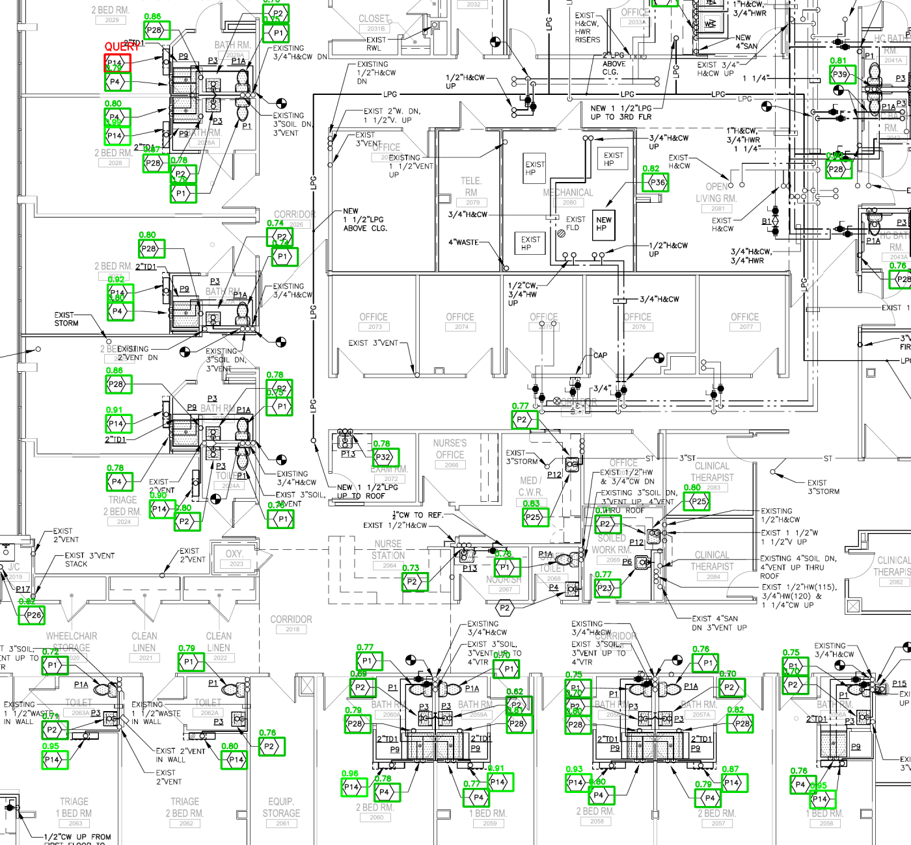
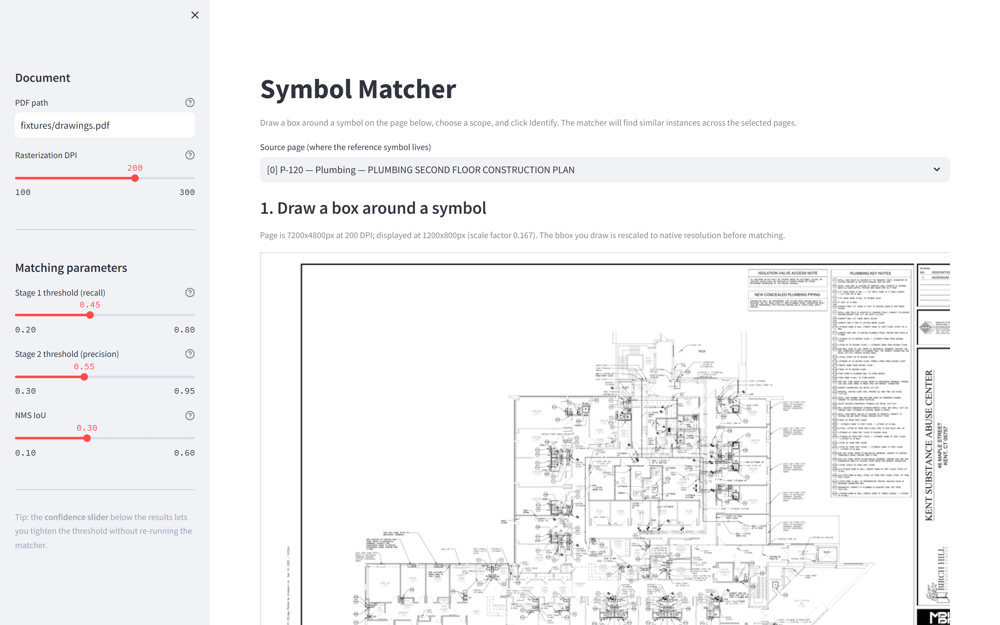
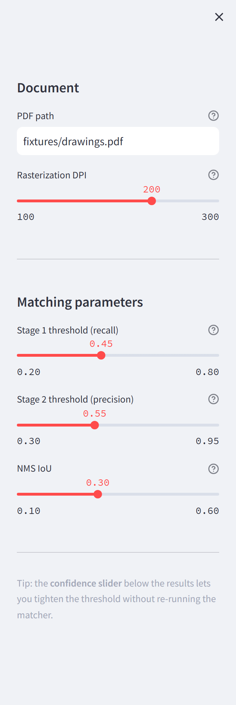
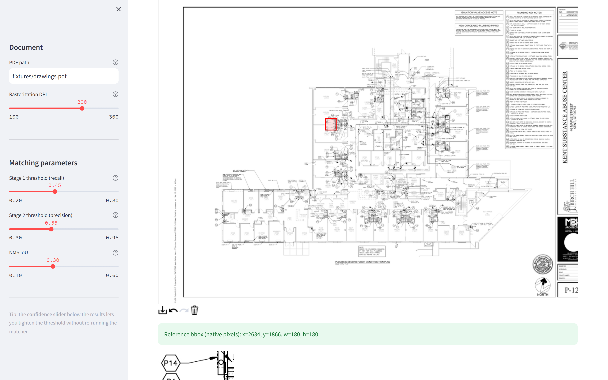
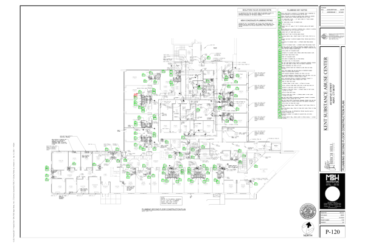
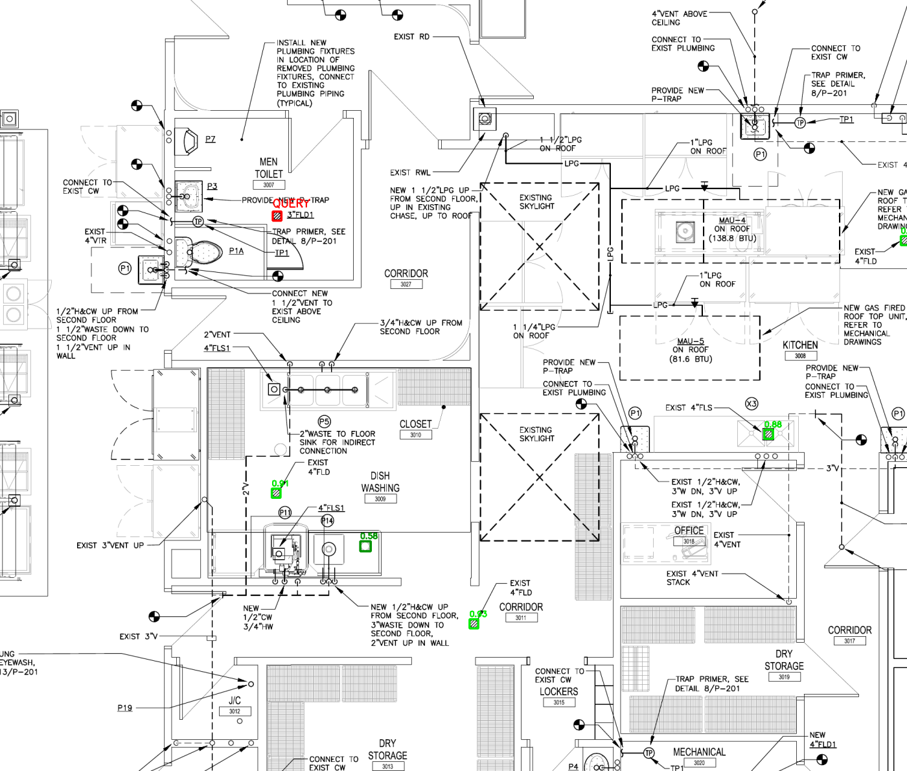

<div align="center">

# Symbol Matcher

### Visual symbol matching for construction drawings — find every instance of a hand-selected symbol across an entire CD set.

[](https://www.python.org/)
[](https://opencv.org/)
[](https://scikit-image.org/)
[](https://streamlit.io/)
[](#license)
[]()

<br/>



<sub><b>Real run</b> — single hexagon callout query (red box, top-left) detected <b>143 matched instances</b> across P-120 alone, with confidence scores per detection. Zero false negatives on visible callouts.</sub>

</div>

---

## Table of Contents

- [Overview](#overview)
- [Why this exists](#why-this-exists)
- [Key Features](#key-features)
- [Live Demo — Streamlit UI](#live-demo--streamlit-ui)
- [Architecture](#architecture)
- [Results](#results)
- [Installation](#installation)
- [Usage](#usage)
  - [Streamlit UI](#streamlit-ui)
  - [Command-Line Interface](#command-line-interface)
  - [Python API](#python-api)
- [Configuration & Tuning](#configuration--tuning)
- [Project Structure](#project-structure)
- [Performance](#performance)
- [Roadmap](#roadmap)
- [Documentation](#documentation)
- [License](#license)

---

## Overview

**Symbol Matcher** is an end-to-end visual matching system that lets a user draw a box around any symbol on a multi-page construction drawing PDF (CD set) and instantly retrieves every other occurrence of that symbol — across the page, across all sheets of the same plan type, or across the entire discipline.

It was built against the spec in [`fixtures/Symbol_Matching_Quick_Def.pdf`](fixtures/Symbol_Matching_Quick_Def.pdf) and validated on real plumbing CDs (Kent Substance Abuse Center, sheets **P-120 / P-121 / P-130**).

> ⚙️ **Built for the field**, not the lab. Recall-first defaults, transparent scoring, deterministic outputs, drop-in behind any UI.

---

## Why this exists

Construction drawings encode every fixture, fitting, and callout as a stylized symbol — repeated dozens to hundreds of times per sheet. Counting, auditing, or cross-referencing them by hand is a multi-hour task that doesn't scale.

This system collapses that task to a **two-second mouse drag**: select once, find everywhere.

| Without Symbol Matcher | With Symbol Matcher |
|---|---|
| Manual visual search through every page | One drag, instant retrieval across the whole CD set |
| Inconsistent counts between reviewers | Deterministic, score-ranked output |
| No traceability | Per-match bounding box, sheet ref, rotation, and stage scores in JSON |
| Hours per audit | Seconds per query (~20s/page at 200 DPI) |

---

## Key Features

- 🎯 **Two-stage hybrid matcher** — multi-scale, multi-rotation NCC on edge maps (recall) → HOG cosine-similarity verification (precision). Pluggable Stage-2 interface for learned embeddings.
- 🗂️ **Automatic page metadata** — extracts AIA-style sheet refs (`P-120`, `E-201`, …), plan names, and disciplines from the PDF itself.
- 🔍 **Spec-aligned scopes** — `page`, `plan_type`, `page_type` filtering matches the upstream definition.
- 🔁 **Rotation invariance** — 0° / 90° / 180° / 270° out of the box; Fourier-Mellin path documented for free-angle.
- 🎚️ **Live confidence slider** — tighten precision after-the-fact without re-running the matcher.
- 📦 **Structured outputs** — `matches.json` (every detection with bbox, score, rotation, per-stage scores), annotated PNGs, per-match crop captures.
- 🖥️ **Two front ends** — interactive Streamlit UI (draw → identify → review) and a scriptable CLI for batch/CI use.
- 🧪 **Deterministic & reproducible** — no model weights, no GPU, no surprise.

---

## Live Demo — Streamlit UI

The UI is designed to look like a tool an estimator would actually use. Pick a source page, drag a box, choose a scope, click **Identify**.

<table>
<tr>
<td width="60%" valign="top">



<sub><b>1. Pick a source page</b> — page metadata (sheet ref, discipline, plan name) is auto-detected and displayed in the page picker.</sub>

</td>
<td width="40%" valign="top">



<sub><b>Tuning sidebar</b> — DPI, Stage-1 / Stage-2 thresholds, and NMS IoU exposed for power users. Defaults are tuned recall-first for the spec's "minimize false negatives" requirement.</sub>

</td>
</tr>
</table>

<br/>



<sub><b>2. Draw the reference box</b> — the canvas operates at native PDF coordinates; the box you drag is rescaled to source resolution before matching, so the symbol is always sampled at maximum fidelity.</sub>

<br/><br/>

<div align="center">

<br/>
<sub><b>3. Reference symbol preview</b> — exactly what the matcher will look for, at native pixel density.</sub>
</div>

---

## Architecture

```
┌─────────────────────────────────────────────────────────────────────────┐
│                          User draws box on page                          │
└───────────────────────────────┬─────────────────────────────────────────┘
                                ▼
┌─────────────────────────────────────────────────────────────────────────┐
│  pages.py  →  Rasterize PDF (poppler / pymupdf) · extract sheet metadata │
│               · build scope-filtered candidate set                      │
└───────────────────────────────┬─────────────────────────────────────────┘
                                ▼
┌─────────────────────────────────────────────────────────────────────────┐
│  matcher.py — Stage 1: multi-scale × multi-rotation NCC on Canny edges   │
│               (recall-first; cheap; produces ~10³ candidates per page)  │
└───────────────────────────────┬─────────────────────────────────────────┘
                                ▼
┌─────────────────────────────────────────────────────────────────────────┐
│  matcher.py — Stage 2: HOG-descriptor cosine similarity verification     │
│               (precision; pluggable — swap for DINOv2 / CLIP / fine-    │
│               tuned encoder behind the same `Verifier` interface)       │
└───────────────────────────────┬─────────────────────────────────────────┘
                                ▼
┌─────────────────────────────────────────────────────────────────────────┐
│  Non-Maximum Suppression (tight IoU) → ranked detections                 │
└───────────────────────────────┬─────────────────────────────────────────┘
                                ▼
┌─────────────────────────────────────────────────────────────────────────┐
│  visualize.py  →  matches.json · annotated PNGs · per-match crops        │
└─────────────────────────────────────────────────────────────────────────┘
```

The Stage-1 / Stage-2 split is the design's core insight: cheap-and-permissive first pass, expensive-and-strict verification second. Each stage's threshold is exposed so you can move along the **recall ↔ precision** curve without touching code.

📐 **Full design rationale:** [`docs/REPORT.md`](docs/REPORT.md)

---

## Results

### Run 1 — Hexagon callout, scope = `plan_type`

Query: a `P14` hexagon callout on **P-120** (59×41 px at 200 DPI). Scope: all *Construction Plan* sheets.


<sub>Full-page annotated view of P-120. <span style="color:red"><b>Red</b></span> = query box. <span style="color:green"><b>Green</b></span> = matched instances, labelled with confidence score.</sub>

<br/>


<sub><b>Zoomed detail</b> — every visible hexagon callout (P1, P2, P4, P14, P28, P39, …) is caught, regardless of its inner label. Score gradient: exact P14 instances → 0.95+, other hexagons (different inner text) → 0.75–0.90. The score itself becomes a useful semantic signal.</sub>

### Run 2 — Floor drain ⌀ symbol, scope = `page_type`

Query: a floor-drain glyph on **P-130** (19×20 px — a tiny, non-text, rotation-sensitive symbol). Scope: all Plumbing sheets.



<sub><b>Bonus: non-text symbol matching</b> — mixed 0° / 180° rotations resolved automatically. Demonstrates the pipeline generalises beyond hex-with-text callouts.</sub>

### Summary

| Run | Query | Scope | Pages | Matches | Notes |
|---|---|---|---|---|---|
| Hexagon callout (`P14`) | 59×41 on P-120 | `page` | 1 | 143 | Score gradient cleanly separates exact-text vs symbol-class hits |
| Same | same | `page_type` | 3 | 186 | Correctly distributes across P-120, P-121; **zero hits** on out-of-class sheet |
| Floor drain ⌀ | 19×20 on P-130 | `page_type` | 3 | 34 | Mixed 0°/180° rotations; tiny non-text symbol |

> End-to-end runtime on the 3-page set, single-threaded Python at 200 DPI: **~57 seconds**. Production scaling design (worker pool + vector-PDF fast path) covered in the report.

---

## Installation

### Prerequisites

- **Python** 3.10 or newer
- **Poppler** (`pdftoppm`, `pdftotext`) for PDF rasterization

<details>
<summary><b>Installing Poppler</b></summary>

| OS | Command |
|---|---|
| **Windows** | `winget install oschwartz10612.Poppler` |
| **macOS** | `brew install poppler` |
| **Debian / Ubuntu** | `sudo apt-get install -y poppler-utils` |
| **Fedora / RHEL** | `sudo dnf install poppler-utils` |

</details>

### Setup

```bash
git clone https://github.com/Osamaali313/Symbol-_Detection_Contech.git
cd Symbol-_Detection_Contech
python -m venv .venv
# Windows:
.venv\Scripts\Activate.ps1
# macOS / Linux:
source .venv/bin/activate
pip install -r requirements.txt
```

That's it. No model downloads, no GPU drivers, no API keys.

---

## Usage

### Streamlit UI

```bash
streamlit run src/app.py
```

Then open <http://localhost:8501>, point it at your PDF, drag a box, and click **Identify**.

### Command-Line Interface

Match a hexagon callout on page 0, search the current page only:

```bash
python -m src.cli \
    --pdf fixtures/drawings.pdf \
    --source-page 0 \
    --bbox 2641,1875,59,41 \
    --scope page \
    --output outputs/run1
```

Same query, searched across all Plumbing pages:

```bash
python -m src.cli \
    --pdf fixtures/drawings.pdf \
    --source-page 0 \
    --bbox 2641,1875,59,41 \
    --scope page_type \
    --output outputs/run2
```

Floor drain symbol with looser Stage-2 threshold:

```bash
python -m src.cli \
    --pdf fixtures/drawings.pdf \
    --source-page 2 \
    --bbox 3001,2266,19,20 \
    --scope page_type \
    --output outputs/run3 \
    --stage2-threshold 0.50
```

Add `--save-crops` to materialise per-match `capture` records (the upstream-persistence the spec describes).

> 🔎 The `--bbox` flag accepts `x,y,w,h` in **pixel coordinates at the rasterization DPI**. In a real UI the user drags a rectangle; this CLI accepts those pixel coords directly so it's drop-in behind any browser/desktop frontend.

### Python API

```python
from src.pages import load_pages_from_pdf, filter_pages_by_scope
from src.matcher import match_symbol_across_pages

pages = load_pages_from_pdf("fixtures/drawings.pdf", cache_dir="fixtures", dpi=200)
source = pages[0]
candidates = filter_pages_by_scope(pages, source, scope="page_type")

matches = match_symbol_across_pages(
    candidates, source, bbox=(2641, 1875, 59, 41),
    stage1_threshold=0.45,
    stage2_threshold=0.55,
    nms_iou=0.30,
)

for m in matches[:10]:
    print(m.sheet_ref, m.bbox, f"{m.score:.2f}", m.rotation)
```

---

## Configuration & Tuning

| Flag | Default | What it does |
|---|---|---|
| `--dpi` | `200` | Rasterization DPI. Higher = more accurate, slower, more memory. 200 is the sweet spot for typical 24"×36" sheets. |
| `--stage1-threshold` | `0.45` | NCC threshold for candidate generation. Lower → more candidates → higher recall, slower. |
| `--stage2-threshold` | `0.55` | HOG similarity threshold for verification. Lower → more matches kept → higher recall, more false positives. |
| `--nms-iou` | `0.30` | Non-max suppression IoU. Lower = stricter = fewer overlapping detections (good for dense pages with adjacent symbols). |

**Defaults are recall-first**, matching the spec's "minimize false negatives" requirement. For a tighter export pass, raise `--stage2-threshold` to `0.70`.

---

## Project Structure

```
symbol-matcher/
├── src/
│   ├── pages.py        # PDF loading, page metadata extraction, scope filtering
│   ├── matcher.py      # Two-stage matching pipeline (the core algorithm)
│   ├── visualize.py    # Annotation and capture-crop rendering
│   ├── cli.py          # CLI entry point
│   └── app.py          # Streamlit UI
├── fixtures/
│   ├── drawings.pdf                    # 3-page plumbing CD set used for validation
│   ├── plumbing_legend.png             # Symbol legend reference
│   └── Symbol_Matching_Quick_Def.pdf   # Original spec
├── docs/
│   ├── REPORT.md           # Full technical report
│   ├── pipeline_diagram.png
│   └── screenshots/        # README visuals
├── tests/
│   └── smoke_test.py
├── outputs/                # Run outputs (gitignored)
├── requirements.txt
└── README.md
```

---

## Performance

| Metric | Value (3-page set, 200 DPI, single-threaded Python) |
|---|---|
| End-to-end (`scope=page_type`, 3 pages) | **~57s** |
| Per-page average | **~19s** |
| Page rasterization (cached after first run) | ~0.5s/page |
| Memory footprint | <1.5 GB peak |
| Hardware | No GPU required |

### Scaling

The pipeline is embarrassingly parallel across pages — production deployment fan-outs per-page workers and merges results. For very large CD sets the vector-PDF fast path (extracting drawing primitives directly via `pymupdf` instead of rasterizing) can drop per-page cost by **10–50×**. Both paths are designed in [`docs/REPORT.md`](docs/REPORT.md).

---

## Roadmap

- [x] Two-stage NCC + HOG pipeline
- [x] 0°/90°/180°/270° rotation invariance
- [x] AIA sheet-ref + plan-name auto-extraction
- [x] Scope filtering (`page` / `plan_type` / `page_type`)
- [x] Streamlit UI with live confidence slider
- [x] Structured `matches.json` outputs
- [ ] Free-angle rotation via Fourier-Mellin / log-polar
- [ ] Vector-PDF fast path (skip raster for digital-native CDs)
- [ ] Pluggable learned Stage-2 (DINOv2 / CLIP / fine-tuned encoder)
- [ ] Multi-symbol batch query
- [ ] REST API wrapper for backend integration

---

## Documentation

- 📘 **[Technical Report](docs/REPORT.md)** — approach, tradeoffs, scaling design
- 📋 **[Original Spec](fixtures/Symbol_Matching_Quick_Def.pdf)**
- 🧪 **[Smoke Test](tests/smoke_test.py)**

---

## License

MIT — see source headers. Built as a Bedrock take-home assessment; portable to any CD-set processing pipeline.

<br/>

<div align="center">
<sub>Built with OpenCV, scikit-image, Streamlit, and a healthy respect for what construction documents actually look like in the wild.</sub>
</div>
