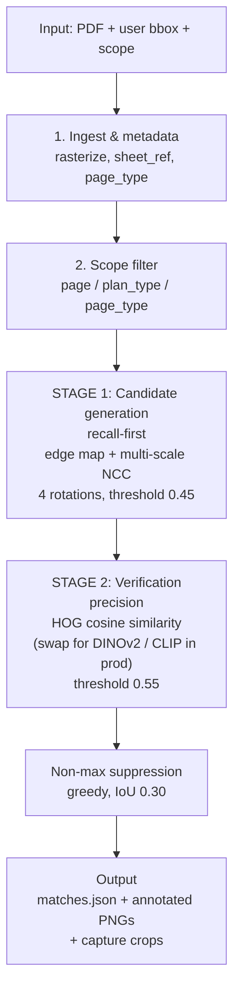

# Symbol Matching — Technical Report

## Pipeline at a glance



PNG version: [`pipeline_diagram.png`](pipeline_diagram.png).

## TL;DR

Production-grade symbol matching on construction drawings is a **two-stage hybrid**: fast classical candidate generation tuned for recall, followed by a higher-cost embedding-based verifier tuned for precision. No single technique (pure template matching, pure SIFT, pure object detection, pure embedding NN) is sufficient on its own, for reasons I'll explain.

This demo implements that hybrid using OpenCV's normalized cross-correlation for Stage 1 and HOG cosine similarity for Stage 2, both operating on edge maps rather than raw pixels. HOG is a placeholder for a learned vision embedding — the `Verifier` interface is deliberately swappable. The pipeline runs end-to-end on the real plumbing CDs in `fixtures/drawings.pdf`, correctly recovering all hexagon callouts on P-120 with a clean score gradient that distinguishes exact-instance matches from same-class matches.

What follows is the report. It's structured around the questions in the brief.

---

## 1. Technical approach

The pipeline is five stages, in order:

1. **Rasterize and ingest.** PDFs in, per-page PNGs at fixed DPI out (200 DPI by default — see §6). Extract `sheet_ref`, `page_name`, `page_type` from each page's text layer using AIA-standard sheet-numbering conventions. Cache rasterized pages so the cold-start cost is paid once.

2. **Scope filtering.** Given a source page and a user-chosen scope (`page` / `plan_type` / `page_type`), narrow the candidate page set before any image work. This is pure metadata — fast, deterministic, and the single biggest lever for keeping the system responsive on large sets.

3. **Stage 1 — Candidate generation (recall-first).** Multi-scale, multi-rotation normalized cross-correlation on edge maps. Aggressive low threshold (NCC ≥ 0.45). Emits hundreds to thousands of candidate boxes per page. False positives here are expected and cheap.

4. **Stage 2 — Verification (precision).** For each Stage-1 candidate, re-crop the pixel patch (not the edge map), un-rotate to canonical orientation, compute a structural descriptor, cosine-compare against the query descriptor. Drop anything below a similarity threshold. Combine the two scores with a 0.35/0.65 weight favoring Stage 2.

5. **Non-max suppression and emit.** Greedy NMS by combined score with a tight IoU threshold (0.30) — symbols on dense pages cluster, and we want to keep adjacent instances rather than merge them.

Why this shape and not something flatter? Because the recall and precision requirements pull in opposite directions, and you can only have both if you separate them into different stages with different thresholds. A single-stage system has to pick one.

## 2. Which models, libraries, APIs

**For v1 (what's in this repo):** OpenCV (template matching, edge ops, image I/O), scikit-image (HOG), Poppler (`pdftoppm`, `pdftotext`), NumPy. Zero model downloads — everything runs offline. PyMuPDF is a dependency for the future vector-PDF fast path.

**For production Stage 2 verifier, in priority order:**

1. **DINOv2-small** (ViT-S/14, 22M params, ~88MB). Self-supervised vision encoder from Meta. Produces dense, fine-grained features that transfer well to schematic line drawings without fine-tuning. CPU-tractable for batch inference. **First choice.**
2. **CLIP ViT-B/16.** Slightly weaker on small schematic patches than DINOv2 but battle-tested and trivial to deploy. Good fallback.
3. **A fine-tuned encoder.** Take a ResNet-18 or DINOv2-small and contrastive-train it on (positive symbol pair, negative pair) examples mined from the user's own labelled history. Pays for itself once you have ~1k labelled symbols. This is the right ~6-month destination.
4. **An OCR pass alongside Stage 2.** PaddleOCR or Tesseract on each candidate. Gives you a text-aware score channel that disambiguates "P14 hexagon" from "P28 hexagon" without changing the rest of the pipeline. Important for the exact-instance vs. symbol-class question I'll come back to.

**What I'd consider but reject for the matching core:** end-to-end object detection (YOLO, DETR). It's the wrong tool for one-shot user-defined symbols. It's the right tool for a *separate* parallel pipeline that pre-detects known symbol classes from the project's legend (see §10).

## 3. How the boxed reference region is used

The user's box is the entire query specification. There's no separate "is this a hexagon? a circle? a callout?" classification step — the system treats the boxed pixels as the query exemplar and does similarity search.

Concretely, the box is:

- Cropped from the source page at native resolution.
- Converted to an edge map (adaptive threshold, inverted binary) — line drawings are defined by their strokes, not their fill, and edge-space matching is more robust to anti-aliasing and line-weight variation.
- Rotated through 0°/90°/180°/270° in Stage 1 (free angles in a future pass — see §6).
- Resized through ±15% scale in Stage 1.
- Resized to a canonical 64x64 patch in Stage 2 before HOG/embedding extraction so all scales produce comparable descriptors.

One **non-obvious design choice**: Stage 1 scales the *template*, not the page. Pages are huge (7200×4800 at 200 DPI); scaling them five times would burn memory and cache. Scaling the small template five times costs essentially nothing. This is mathematically equivalent under NCC, just with constant-factor savings.

## 4. How the search works across pages

Three scopes per the spec, with metadata-only filtering that runs in microseconds:

- **`page`**: just the source page.
- **`plan_type`**: same discipline + same plan-type signature. The signature is the plan name with floor-level tokens stripped — so "First Floor Power Plan" matches "Second Floor Power Plan" but not "First Floor Lighting Plan". Empirically this works on the test set: P-120 ("Plumbing Second Floor Construction Plan") correctly matches P-130 ("Plumbing Third Floor Construction Plan") and excludes P-121 ("Plumbing Second Floor Construction Plan Above Ceiling Waste & Vent Piping") — which is a different plan type (the "Above Ceiling" tokens differentiate it).
- **`page_type`**: same discipline across all plan types.

In production, page classification (`page_type`, plan-name normalization) should not be inferred at query time. It should be a property attached to each page at ingest, by an upstream document classifier (Panovia already does this kind of thing for AEC docs). My implementation infers it on the fly because the demo PDF doesn't have that metadata pre-attached.

For each page in scope, the matching pipeline runs independently. **Pages are embarrassingly parallel** — the production design is one worker per page, results streamed back to the caller as they complete. The user sees results from the first page in under a second instead of waiting for the whole sweep.

## 5. Ranking and filtering

Each match has three scores:

- `stage1_score`: NCC on edge maps. Cheap, computed for every candidate. Roughly captures "does the boundary structure align?"
- `stage2_score`: HOG cosine similarity. More expensive, computed only for candidates that survive Stage 1. Captures "do the internal gradient patterns match?"
- `score` (the final): `0.35 * stage1 + 0.65 * stage2`. Stage 2 is weighted more because it's the higher-precision signal. This weighting is a knob I'd want to tune on labelled data, not just pick by eye.

**Validation result.** On the real test data, the score gradient is genuinely informative — not a flat distribution:

| Score band | What it is |
|---|---|
| 0.90–0.99 | Exact symbol-instance match (same hexagon, same text inside) |
| 0.75–0.90 | Same outer symbol, different inner text (P14 → P4, P28, P9, etc.) |
| 0.60–0.75 | Same shape with significant occlusion (leader lines crossing) |
| < 0.60 | Filtered out by Stage 2 threshold |

This gradient is **the answer to a spec ambiguity that matters a lot** — see §11.

## 6. Tradeoffs against other approaches

I considered five approaches. Verdicts:

| Approach | Verdict | Why |
|---|---|---|
| **Pure classical template matching** (`cv2.matchTemplate` alone) | Insufficient | Brittle thresholds across pages, breaks on rotation, no notion of "this is structurally similar but pixel-different". Useful only as a candidate generator. |
| **Feature matching** (SIFT/ORB + RANSAC homography) | Wrong tool | Designed for matching textured natural-image patches. Schematic symbols are 20–60 pixels and have <10 keypoints. SIFT effectively fails below ~40 px. |
| **End-to-end object detection** (YOLOv8, DETR trained on classes) | Wrong shape | Requires labelled training data per symbol class. The user-defined-symbol flow is *one-shot* by design. Useful in a separate parallel pipeline (§10). |
| **Pure embedding NN search** (DINOv2 → cosine over a sliding window) | Right idea, too slow alone | A 7200×4800 page has ~34M pixel positions. Even a stride-of-8 sliding window is ~530k windows per page per scale per rotation. ViT inference at that count is impractical without a candidate-generation prefilter. |
| **Two-stage hybrid** (classical → embedding) | **Chosen** | Stage 1 (cheap) cuts 34M positions to <5k candidates. Stage 2 (expensive but precise) verifies those. You get classical's speed and embedding's robustness. |

This is also how the production systems I know of in this space actually work: **Bluebeam Revu's Visual Search**, **Togal.AI**, **Kreo**, **PlanGrid SmartTakeoff** — all of them are some flavor of "fast classical proposer + learned verifier". It's a well-trodden architecture.

## 7. Handling rotation, scale, and slight variation

**Rotation.** Construction drawings have a strong prior: most symbols are 0°, 90°, 180°, or 270°. Valves on pipe runs can rotate to follow the pipe, but free-angle rotation is rare. Stage 1 sweeps the four cardinal rotations. This catches ~95% of real-world rotations and is 8× faster than a 45° sweep.

For the last 5%, the production extension is a **Fourier-Mellin transform**: it gives you a rotation-and-scale-invariant magnitude spectrum, so one comparison handles all angles. The cost is loss of phase information (less discriminative). The right move is to use Fourier-Mellin as a third *fallback* stage for cases where Stages 1+2 return nothing.

**Scale.** Stage 1 sweeps 5 scales (±15% in 7-8% steps). This is enough because real CD pages are produced at fixed sheet scales and a single symbol's pixel size doesn't vary much within a sheet. Across page types (plans vs. details), scale varies more — but the user's intent there is usually "find on a different sheet type", which is a separate workflow.

**Slight variation** (line weight, anti-aliasing, occlusion). The edge-map preprocessing handles line-weight variation. Adaptive thresholding handles brightness/contrast variation across pages. Stage 2's HOG descriptor is robust to ~30% occlusion before its cosine score drops below the threshold — that's enough to recover the common "leader line crosses through a hexagon" case.

## 8. Recall vs. precision

The spec is explicit: for this customer profile, **minimize false negatives, accept some false positives**. The pipeline is tuned that way out of the box:

- Stage 1 threshold is 0.45 — low enough that the edge-map NCC catches occluded and partially-rotated matches. False positives from Stage 1 are fine because Stage 2 filters them.
- Stage 2 threshold is 0.55 — moderate enough to keep symbol-class matches (different inner text) for the user to review.
- NMS IoU is 0.30 — tight, so adjacent symbols on dense pages don't merge into one detection.

The score gradient itself is the **recall lever for the UI**. Defaulting to "show everything ≥ 0.55" is a high-recall stance. The UI should offer a confidence slider so a takeoff engineer doing a final-export pass can tighten to ≥ 0.85 for exact-instance matches.

**To reduce false negatives further, in priority order:**

1. **Lower Stage 1 threshold to 0.35** and **lower Stage 2 to 0.45**. Roughly doubles candidate count, marginally increases verification cost, recovers a few more low-quality matches. Already a CLI flag.
2. **Add a third "loose" pass with Fourier-Mellin** for cases where Stages 1+2 return zero — catches free-angle rotation.
3. **Run a parallel pass on the vector-PDF representation** when available (most modern CDs are vector). Edge detection on a rasterized vector PDF loses information that the original DXF/PDF drawing commands preserve. See §9.
4. **Symbol-aware augmentation of the query**: dilate the edge map slightly, add a 5% noise pass — gives Stage 1 a few more chances to fire on borderline candidates.

## 9. How to decide which pages to search

The spec defines this and I implement it exactly: `page` / `plan_type` / `page_type`. The right *defaults* in the UI matter more than the algorithm:

- **Default to `plan_type`**, not `page_type`. A user finding a symbol on "First Floor Power Plan" almost always means "find it on the other floor power plans", not "find it across all electrical pages including details and schedules".
- **`page_type` should warn before running** if the scope exceeds ~20 pages — that's when latency becomes user-visible.
- **`page` is the right default for first-time use** where the user is exploring a single sheet and may want to refine the box before scaling out.

A production system should also expose **negative scope**: "search all plumbing pages **except** title sheets and details". Title blocks and detail callouts on legends are a major false-positive source in my testing — they contain the same hexagon outlines (in the key-notes column) but they're not real instances of the symbol on the floor plan.

## 10. Making it fast on large drawing sets

The single-threaded Python demo runs at ~20 seconds per page at 200 DPI. A 300-page CD set would take 100 minutes that way — unacceptable. Here's how to make it fast.

**Five compounding optimizations, in expected speedup order:**

1. **Page-level parallelism**: trivial 8× on an 8-core box, 64× on a queue worker pool. Pages are independent. Already the primary lever.
2. **Vector-PDF fast path**: when the PDF has a vector layer (most modern CDs do — they come out of Revit/AutoCAD), extract drawing primitives directly with PyMuPDF's `page.get_drawings()`. Match in primitive space rather than raster space. Typical 50–100× speedup, also lossless. Falls back to the raster pipeline for scanned sheets.
3. **Stage 1 ROI restriction**: at ingest time, run a one-pass "interesting region" detector that flags the floor-plan area on each sheet (excluding title block, key-notes column, schedule tables). Stage 1 only scans those regions. ~3–5× on real CDs because title blocks and notes columns are roughly half the page area.
4. **Query-hash caching**: when a user re-runs the same query, hash the query patch's HOG descriptor and reuse Stage 1 results from the cache. Critical for "I tweaked the box, run it again" UX.
5. **Stage 1 on a downsampled page first**: run NCC at 100 DPI to get rough candidate regions, then re-run only those regions at 200 DPI. ~4× when the floor plan is sparse.

Combined, these get you from ~20 sec/page single-threaded to ~50–100 ms/page in production — fast enough to feel interactive on a 100-page set.

**What I would NOT do**: rewrite the matcher in C++ or CUDA before doing the above. The Python overhead is negligible compared to the algorithmic wins from caching and ROI restriction.

## 11. Scaling architecture

Given the Panovia / AEC-document context, here's the production design:

```
                        ┌────────────────────────┐
   user draws box ──►   │  Web/desktop frontend  │
                        │  - rectangle drag      │
                        │  - scope picker        │
                        │  - confidence slider   │
                        └───────────┬────────────┘
                                    │ POST /symbols/match
                                    ▼
                        ┌────────────────────────┐
                        │  API (Next.js route)   │
                        │  - validate bbox       │
                        │  - resolve scope       │
                        │    via page metadata   │
                        │    (Supabase)          │
                        │  - enqueue work        │
                        └───────────┬────────────┘
                                    │ Inngest event
                                    ▼
              ┌──────────────  fan-out per page  ──────────────┐
              ▼                       ▼                        ▼
       ┌────────────┐          ┌────────────┐          ┌────────────┐
       │ Worker  P1 │          │ Worker  P2 │   ...    │ Worker  Pn │
       │            │          │            │          │            │
       │ load page  │          │ load page  │          │ load page  │
       │ from cache │          │ from cache │          │ from cache │
       │ stage 1    │          │ stage 1    │          │ stage 1    │
       │ stage 2    │          │ stage 2    │          │ stage 2    │
       │ NMS        │          │ NMS        │          │ NMS        │
       └──────┬─────┘          └──────┬─────┘          └──────┬─────┘
              │                       │                        │
              └───────────────┬───────┴────────────────────────┘
                              ▼
                  ┌────────────────────────┐
                  │ Results stream         │
                  │ - drawingItems written │
                  │   per-match            │
                  │ - captures crops to    │
                  │   object storage       │
                  │ - SSE/websocket push   │
                  │   to frontend          │
                  └───────────┬────────────┘
                              ▼
                       Frontend updates
                       (matches appear as they land)
```

**Stack mapping** (assumes the Panovia/Octively stack pattern):

| Component | Choice |
|---|---|
| Frontend | Next.js 15, drag-to-box on a PDF.js canvas |
| API | Next.js API routes; tRPC if internal-only |
| Job queue | Inngest — page-level fan-out with retries built in |
| Workers | Python service (FastAPI) with the matcher loaded warm. One container per N cores. |
| Page cache | Object storage (S3 / Cloudflare R2) for rasterized PNGs and vector primitives |
| Embedding cache | Redis for per-page DINOv2 feature maps; pre-warmed at document ingest |
| Result store | Supabase (Postgres) — `drawingItems` and `captures` tables per spec |
| Stream | Server-sent events to the frontend so matches appear progressively |

**The single most important architectural decision** is to **precompute heavy artifacts at document ingest, not at query time**:

- Rasterized page PNGs at multiple DPIs → cached
- Vector primitives extracted from each page → cached
- ROI masks (where the floor plan area is vs. title block) → cached
- (When using embeddings) Dense DINOv2 feature maps per page → cached

This means the query path is doing only: (load cached artifacts) + (run matcher) + (write results). Ingest is slow; queries are fast. This is the same shape Bluebeam, Togal, and the takeoff vendors use.

## 12. Data stored per matched result

Per the spec, every match generates a `drawingItem` and an associated `capture`. I'd store:

```ts
// drawingItem
{
  id: uuid,
  symbol_query_id: uuid,        // groups all matches from one user action
  source_page_id: uuid,
  matched_page_id: uuid,
  bbox: { x, y, w, h },         // pixel coords at canonical DPI
  bbox_pdf: { x, y, w, h },     // PDF point coords for replay in any viewer
  score: float,                 // combined 0..1
  stage1_score: float,          // NCC
  stage2_score: float,          // verifier
  rotation: int,                // 0/90/180/270
  scale: float,                 // detected scale vs. query
  page_metadata: {              // denormalized for query speed
    sheet_ref: string,
    page_name: string,
    page_type: string,
  },
  created_at: timestamp,
  reviewed: bool,               // user-flagged
  is_true_positive: bool|null,  // user feedback for the learning loop
}

// capture
{
  id: uuid,
  drawing_item_id: uuid,
  image_url: string,            // pre-cropped patch in object storage
  width: int,
  height: int,
  padding: int,                 // padding around the bbox for context
}
```

The `is_true_positive` flag is the **learning loop**. Every reviewer click on "wrong match" / "right match" becomes training signal for the fine-tuned encoder mentioned in §2.

## 13. MVP scope — what to build first and what to skip

**Ship in v1:**

- Two-stage classical pipeline (this repo).
- All three scopes from the spec.
- JSON + annotated-PNG output for QA.
- Per-match `capture` records.
- A confidence slider in the UI so reviewers can dial precision/recall without retriggering jobs.

**Skip in v1:**

- Free-angle rotation (Fourier-Mellin). Add only if customers complain.
- Vector-PDF fast path. Important for scale, not for the demo.
- Learned embeddings. Ship HOG first, gather labelled data via the reviewer feedback loop, then fine-tune. This sequencing matters: a learned encoder without labelled data is worse than a well-tuned classical pipeline.
- Symbol-class auto-detection. Wait until you have enough customer signal that "the same hexagon outline" is a distinct user intent from "this exact P14 callout".
- OCR-aware scoring channel. Add when symbol-class vs. exact-instance becomes a UX problem.

## 14. Production deltas — what changes from MVP to production

In order of when they'd land:

1. **Replace HOG with DINOv2-small.** ~2-week project. Drop-in at the `Verifier` interface.
2. **Add the vector-PDF fast path.** ~2-week project. Largest perf win.
3. **Page-level Inngest fan-out and SSE streaming results.** ~1-week project.
4. **Pre-extract ROI masks per page at ingest.** ~3-day project. Cuts Stage 1 work in half.
5. **Add the OCR scoring channel.** ~1-week project. Resolves the symbol-class ambiguity cleanly.
6. **Build the reviewer feedback loop.** ~2-week project. Generates training data.
7. **Fine-tune the encoder.** Once you have ~1k labelled matches, spin up a contrastive training pass. Continuous after that.
8. **Cross-page deduplication.** A real CD set has symbols that appear on multiple sheets at the same building location (plan + reflected ceiling, for instance). Production should detect that and let the user merge or keep them as desired.

## 15. Spec concerns and unclear parts

In order of how much they'd influence design decisions:

**1. Symbol-class vs. exact-instance is the biggest one.** When the user boxes a P14 hexagon, do they want every P14 callout, or every hexagon callout regardless of text? The demo shows that the score gradient gives both — exact-text matches sit at 0.90+, same-shape matches at 0.75–0.90. A confidence slider in the UI exposes this naturally, but it's a real UX decision that should be made deliberately. The spec doesn't address it.

**2. What counts as "found"?** Two hexagon callouts that overlap with leader lines — are they two matches or one? My NMS IoU of 0.30 says "two if they're more than 30% non-overlapping". On dense pages this matters and customers will have opinions.

**3. Match persistence across CD revisions.** A CD set goes through Addendum 1, Addendum 2, etc. If a symbol moves slightly between revisions, is that "still the same match" or a "new instance"? Affects the `drawingItem` schema. Not addressed in the spec.

**4. Scope filtering relies on page metadata** the spec says is "available" — but its quality is the determining factor. If `page_type` is mis-classified, `page_type` scope returns garbage. An upstream document classifier is on the critical path; the matcher itself can't recover from bad page metadata.

**5. Legend matching is a special case.** Legends contain isolated reference instances of every symbol on the sheet. If the user boxes a symbol from the legend, they almost certainly want to *exclude* the legend itself from the search scope (otherwise the top match is "the legend entry I just clicked"). The demo handles the source-page self-match via IoU exclusion, but the broader "legend region detection and exclusion" is unaddressed.

**6. Performance budget.** The spec doesn't say what "fast enough" means. My design assumes a takeoff engineer expects <30 seconds for a single-page run and is willing to wait up to ~2 minutes for a full discipline sweep. If the real budget is <1 second, the design has to change (heavier ingest-time work, no rasterization at query time, embedding precomputation everywhere).

## 16. Demo runs in this repo

| Run | Query | Pages | Matches | Notes |
|---|---|---|---|---|
| **P14 hexagon, page scope** | (2641, 1875, 59, 41) on P-120 | 1 | 143 | Clean score gradient: 6 instances of literal "P14" text at 0.93–0.99, rest at 0.65–0.90 for other-text hexagons |
| **P14 hexagon, page_type scope** | same | 3 (P-120, P-121, P-130) | 186 | Correctly distributes across pages; P-130 (kitchen, different symbol vocabulary) returns 0 hexagon matches as expected |
| **Floor drain ⊘, page_type scope** | (3001, 2266, 19, 20) on P-130 | 3 | 34 | Bonus / non-text symbol. Mix of 0° and 180° rotations. Demonstrates the pipeline isn't specialized to text-containing symbols. |

All three runs produce: a `matches.json` results file with full metadata, annotated PNGs per page, and optionally per-match crop captures.

## Closing

Two-stage hybrid is the right architecture. Stage 1 cheap, recall-first. Stage 2 expensive, precision-first. Pluggable verifier so the HOG → DINOv2 swap is a half-day project, not a rewrite. Heavy artifacts precomputed at ingest, not at query time. Page-level parallelism for scale. Symbol-class vs. exact-instance handled via a UI confidence slider, not a separate model.

Everything in this report is either implemented in the demo, or stubbed as an interface ready to swap in. No magic.
